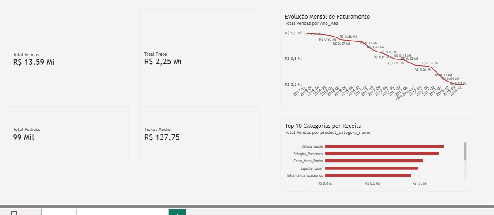
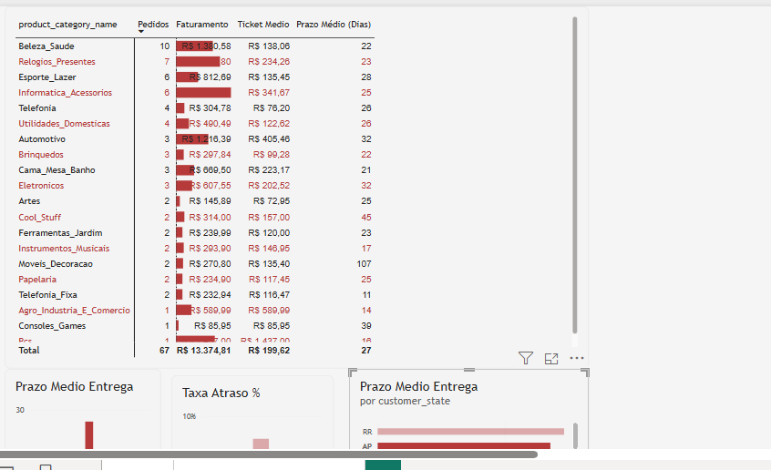

# E-Commerce Data Analytics: Dashboard Power BI & Análise Exploratória em Python

Projeto integrado de **Business Intelligence** e **Análise Exploratória de Dados (EDA)** desenvolvido sobre a base transacional de e-commerce brasileiro (**Olist**). O objetivo é diagnosticar o desempenho comercial, padrões de compra e eficiência logística de ponta a ponta.

---

## 🖥️ 1. Dashboard em Power BI

O painel foi construído no **Power BI Desktop** utilizando modelagem dimensional (**Star Schema**) e métricas analíticas em **DAX**.

### Visão Geral das Páginas
1. **Performance de Vendas:** Acompanhamento de Faturamento Total, Volume de Pedidos, Ticket Médio, sazonalidade mensal de receita e ranking das Top 10 categorias.
2. **Gestão de Produtos & Entregas:** Monitoramento de tempo médio de entrega (em dias), taxa de pedidos atrasados por região e análise cruzada de rentabilidade vs. logística.

### Capturas do Dashboard



---

## 🐍 2. Análise Exploratória & Tratamento em Python

Disponível no Jupyter Notebook [`analise_exploratoria_olist.ipynb`](analise_exploratoria_olist.ipynb):

- **Tratamento de Dados:** Conversão de tipos temporais (`pd.to_datetime`), tratamento de valores ausentes/nulos e consolidação relacional via `merge`.
- **Estatística Descritiva:** Cálculo de medidas de tendência central e dispersão (média, mediana, desvio padrão e quartis).
- **Visualização de Dados:** Matriz de correlação linear (Pearson), histogramas de distribuição de ticket e gráficos de barras comparativos por UF com **Pandas**, **Matplotlib** e **Seaborn**.

---

## 📁 Estrutura do Repositório

```text
├── img/
│   ├── dashboard_vendas.png          <- Captura da página 1 do Power BI
│   └── dashboard_logistica.png       <- Captura da página 2 do Power BI
├── analise_exploratoria_olist.ipynb  <- Notebook com script Python e gráficos
├── dashboard_ecommerce_olist.pbix    <- Arquivo do dashboard interativo
└── README.md                         <- Documentação completa do projeto
```

---

## 🛠️ Tecnologias Utilizadas
- **Power BI:** DAX, Power Query, Star Schema
- **Python:** Pandas, NumPy, Matplotlib, Seaborn
- **Git & GitHub:** Controle de versão e documentação
